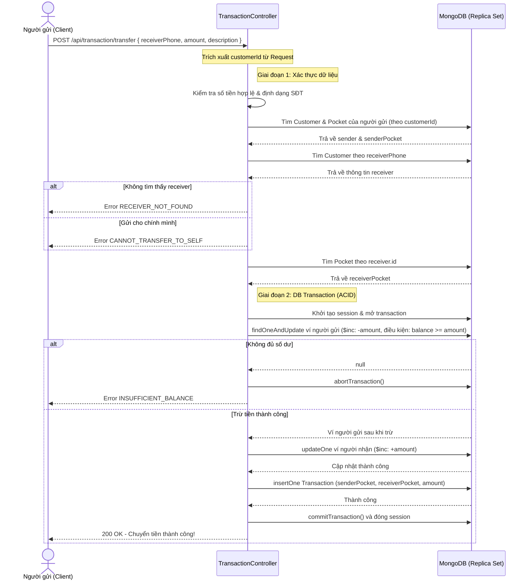

# Luồng Chuyển Tiền (P2P) của mini-mini-wallet

```mermaid
sequenceDiagram
    actor Client as Người gửi (Client)
    participant API as TransactionController
    participant DB as MongoDB (Replica Set)

    Client->>API: POST /api/transaction/transfer { receiverPhone, amount, description }
    Note over API: Trích xuất customerId từ Request

    Note right of API: Giai đoạn 1: Xác thực dữ liệu
    API->>API: Kiểm tra số tiền hợp lệ & định dạng SĐT
    API->>DB: Tìm Customer & Pocket của người gửi (theo customerId)
    DB-->>API: Trả về sender & senderPocket
    
    API->>DB: Tìm Customer theo receiverPhone
    DB-->>API: Trả về thông tin receiver
    
    alt Không tìm thấy receiver
        API-->>Client: Error RECEIVER_NOT_FOUND
    else Gửi cho chính mình
        API-->>Client: Error CANNOT_TRANSFER_TO_SELF
    end

    API->>DB: Tìm Pocket theo receiver.id
    DB-->>API: Trả về receiverPocket

    Note right of API: Giai đoạn 2: DB Transaction (ACID)
    API->>DB: Khởi tạo session & mở transaction

    API->>DB: findOneAndUpdate ví người gửi ($inc: -amount, điều kiện: balance >= amount)

    alt Không đủ số dư
        DB-->>API: null
        API->>DB: abortTransaction()
        API-->>Client: Error INSUFFICIENT_BALANCE
    else Trừ tiền thành công
        DB-->>API: Ví người gửi sau khi trừ

        API->>DB: updateOne ví người nhận ($inc: +amount)
        DB-->>API: Cập nhật thành công

        API->>DB: insertOne Transaction (senderPocket, receiverPocket, amount)
        DB-->>API: Thành công

        API->>DB: commitTransaction() và đóng session
        API-->>Client: 200 OK - Chuyển tiền thành công!
    end
```