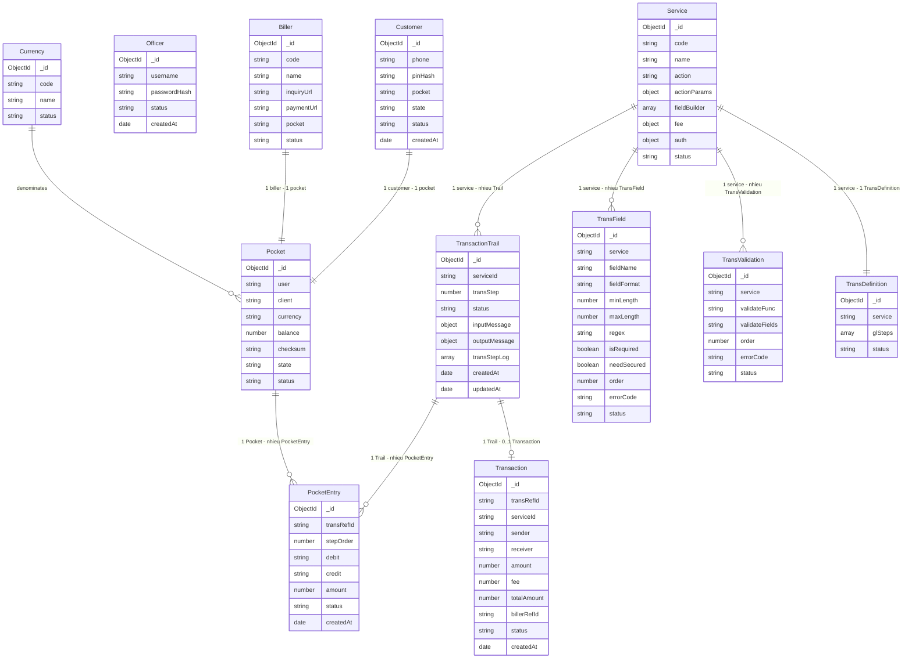

# Mini-Wallet — ERD & Data Dictionary (Tuần 2)

> **Cơ sở dữ liệu:** MongoDB (NoSQL, document-based)
> **Tham chiếu:** `MINIWALLET.md` Phần 9 + `WEEK2-DESIGN-BRIEF.md` Mục 5-6

---

## 1. Data Domains

Hệ thống được chia thành **3 miền lưu trữ tách biệt về bản chất logic**, phản ánh đúng kiến trúc config-driven:

| Miền | Mô tả | Tính chất |
|------|-------|-----------|
| **Configuration** | Cấu hình do Officer tạo: Service, TransField, TransValidation, TransDefinition | Đọc nhiều (Read-heavy). Dữ liệu ít thay đổi. Là "bản vẽ kỹ thuật" engine đọc tại runtime. |
| **Ledger & Engine** | Trạng thái tài chính và luồng giao dịch: Pocket, PocketEntry, TransactionTrail, Transaction | ACID bắt buộc. Ghi nhiều (Write-heavy). Yêu cầu chính xác tuyệt đối. |
| **Entity** | Định danh chủ thể: Customer, Officer, Biller, Currency | Ít thay đổi. Là nguồn gốc sinh ra Pocket và trigger giao dịch. |

> Tách 3 miền giúp scale độc lập: Config có thể cache; Ledger cần session transaction; Entity cần index tìm kiếm nhanh.

---

## 2. Entity Relationship

### 2.1 Miền Configuration

- **Service** đóng vai trò trung tâm — điểm neo của mọi config.
- Service liên kết **1-N** với `TransField` và `TransValidation` qua khoá ngoại `service = String(service._id)`.
- Service liên kết **1-1** với `TransDefinition`.

### 2.2 Miền Ledger & Engine

- Mỗi `Customer` hoặc `Biller` liên kết **1-1** với một `Pocket`. Hệ thống còn khởi tạo Pocket độc lập (System, Bank).
- Mỗi `TransactionTrail` nhận diện qua `transRefId = String(trail._id)` — truyền xuyên suốt 3 bước API.
- Khi Verify thành công: một `Trail` liên kết **1-1** với một `Transaction` và **1-N** với `PocketEntry`. Tất cả tham chiếu qua `transRefId`.

---

## 3. ERD — Sơ đồ quan hệ (Mermaid)



---

## 4. Data Dictionary

> **Quy ước:**
> - `_id` (ObjectId) tự sinh bởi MongoDB — không lặp lại ở từng bảng.
> - **FK = `String(objectId)` xuyên suốt** — nhất quán, tránh Mongoose cast error.
> - `createdAt` / `updatedAt` do Mongoose `{ timestamps: true }` quản lý.

---

### 4.1 Miền Configuration

---

#### Model: `Service`

> Mô tả danh tính nghiệp vụ, luật dựng biến, phí và cơ chế xác thực. Điểm neo của mọi config khác. Officer tạo và kích hoạt; engine đọc tại cả 3 bước.

| Thuộc tính     | Kiểu          | Mô tả & Ràng buộc |
|----------------|---------------|-------------------|
| `code`         | String        | Mã nghiệp vụ duy nhất. unique index. VD: P2P_TRANSFER, CASH_IN, BILL_PAYMENT. |
| `name`         | String        | Tên hiển thị cho Officer trên UI. |
| `action`       | String        | `none` (P2P, Cash-in) hoặc `billerTrans` (Bill Payment — kích hoạt enquiry/payment URL). |
| `actionParams` | Object        | Tham số phụ. Với billerTrans: `{ billerId: String(Biller._id) }` — FK nhất quán với quy tắc String(objectId). Engine tra Biller bằng `_id`, không phải `Biller.code`. |
| `fieldBuilder` | Array<Object> | Mảng luật dựng biến. Mỗi phần tử: `{ order, name, rule, source, variable, query, datatype, errorCode }`. |
| `fee`          | Object        | `{ type: 'fixed'/'percent', value: Number, max?: Number }`. Phí = 0 thì step phí bị bỏ qua. Toàn bộ phí vào ví System. |
| `auth`         | Object        | `{ method: 'PIN'/'NONE' }`. Cash-in dùng NONE (bỏ bước Confirm); P2P và Bill dùng PIN. |
| `status`       | String        | `active` / `inactive`. Engine từ chối giao dịch nếu inactive. |

> **`fieldBuilder[]` — cấu trúc mỗi luật dựng biến:**
>
> | Field     | Kiểu   | Mô tả |
> |-----------|--------|-------|
> | order     | Number | Thứ tự thực hiện. |
> | name      | String | Tên biến đích trong TRANSBODY (VD: SENDERID, RECEIVERID, AMOUNT). |
> | rule      | String | `fixed` / `mapping` / `query`. |
> | source    | String | *(chỉ mapping)* Đường dẫn từ body input (VD: parameters.receiverPhone). |
> | variable  | String | *(chỉ fixed)* Giá trị hằng số (VD: VND). |
> | query     | String | *(chỉ query)* Hàm tra DB (VD: queryPocketByUserId(USERID).id). |
> | datatype  | String | Kiểu kết quả: string / number / object. |
> | errorCode | String | Mã lỗi nếu dựng biến thất bại. |

---

#### Model: `TransField`

> Hợp đồng định dạng từng field trong TRANSBODY. Engine validate tại Request bước 3 và Verify bước 3.
> **Khoá ngoại:** `service = String(Service._id)`

| Thuộc tính    | Kiểu    | Mô tả & Ràng buộc |
|---------------|---------|-------------------|
| `service`     | String  | FK = String(Service._id). |
| `fieldName`   | String  | Tên biến trong TRANSBODY. VD: SERVICEID, RECEIVERPHONE, AMOUNT. |
| `fieldFormat` | String  | Kiểu dữ liệu: `string` / `number` / `objectId`. |
| `minLength`   | Number  | Độ dài / giá trị tối thiểu. |
| `maxLength`   | Number  | Độ dài / giá trị tối đa. |
| `regex`       | String  | Pattern validation (VD: regex SĐT Việt Nam). |
| `isRequired`  | Boolean | Field có bắt buộc trong TRANSBODY không. |
| `needSecured` | Boolean | Có che trong log không (VD: PIN). Default: false. |
| `order`       | Number  | Thứ tự validate. |
| `errorCode`   | String  | Mã lỗi trả về nếu field này fail validate. |
| `status`      | String  | `active` / `inactive`. |

> ⚠️ **Cạm bẫy (Brief mục 9 #1):** Mọi Service PHẢI có ít nhất 1 TransField với `fieldName = "SERVICEID"`. Engine dùng field này để tra TransDefinition. Thiếu → engine không chạy được.

---

#### Model: `TransValidation`

> Khai báo các luật nghiệp vụ phải đúng trước khi tiền chạy. Engine chạy tại Request bước 5 và Verify bước 5.
> **Khoá ngoại:** `service = String(Service._id)`

| Thuộc tính       | Kiểu   | Mô tả & Ràng buộc |
|------------------|--------|-------------------|
| `service`        | String | FK = String(Service._id). |
| `validateFunc`   | String | Tên hàm validator. VD: validateReceiverIsNotSender, validateSenderAccountSufficiency. |
| `validateFields` | String | Biến TRANSBODY truyền vào hàm, phân cách bằng `:`. VD: SENDERID:RECEIVERID. |
| `order`          | Number | Thứ tự chạy validator. |
| `errorCode`      | String | Mã lỗi trả về khi validator fail. |
| `status`         | String | `active` / `inactive`. |

> **Danh sách validator cốt lõi:**
>
> | Hàm | validateFields | Kiểm tra |
> |-----|----------------|---------|
> | validateReceiverIsNotSender | SENDERID:RECEIVERID | Không chuyển tiền cho chính mình |
> | validateSenderAccountSufficiency | SENDERID:AMOUNT:DEBITFEE | Số dư ví gửi >= AMOUNT + DEBITFEE |
> | validateSenderChecksum | SENDERID | Checksum ví gửi hợp lệ |
> | validateReceiverChecksum | RECEIVERID | Checksum ví nhận hợp lệ |

---

#### Model: `TransDefinition`

> Kịch bản ghi sổ kép — "trừ ví nào, cộng ví nào, bao nhiêu". Engine CHỈ đọc tại Verify trong `session.withTransaction`. Quan hệ 1-1 với Service.
> **Khoá ngoại:** `service = String(Service._id)`

| Thuộc tính | Kiểu          | Mô tả & Ràng buộc |
|------------|---------------|-------------------|
| `service`  | String        | FK = String(Service._id). unique index — 1 service : 1 definition. |
| `glSteps`  | Array<Object> | Danh sách bút toán. Xem cấu trúc bên dưới. |
| `status`   | String        | `active` / `inactive`. |

> **`glSteps[]` — cấu trúc mỗi bút toán:**
>
> | Field  | Kiểu       | Mô tả |
> |--------|------------|-------|
> | order  | Number     | Thứ tự thực hiện (0-indexed). |
> | amount | **String** | **Tên biến** trong TRANSBODY — KHÔNG phải giá trị số. VD: `"AMOUNT"`, `"DEBITFEE"`. Engine đọc tên này rồi tra giá trị thực từ TRANSBODY lúc chạy. |
> | debit  | Object     | `{ level, target }` — ví bị trừ tiền. |
> | credit | Object     | `{ level, target }` — ví được cộng tiền. |
>
> **Giải thích `level` / `target`:**
>
> | level        | target | Nghĩa |
> |--------------|--------|-------|
> | productLevel | `SENDERID` / `RECEIVERID` | Ví động — tra từ TRANSBODY lúc chạy. Engine lấy giá trị biến này (= String(Pocket._id)) để xác định ví. |
> | wallet       | `String(Pocket._id)` cố định | Ví System hoặc Bank — Officer điền trực tiếp ID ví khi tạo config. |
>
> ⚠️ **Cạm bẫy (Brief mục 9 #2):** FK của TransDefinition là `service = String(service._id)`, KHÔNG dùng `service.code` làm khoá ngoại.
>
> **Quy tắc:** Step có `amount` resolve thành 0 → **BỎ QUA**. `Sum(debit) == Sum(credit)` bắt buộc.

---

### 4.2 Miền Ledger & Engine

---

#### Model: `Pocket`

> Số dư của một chủ thể. Đơn vị cơ bản của sổ cái. Mọi thay đổi tiền đều là cộng/trừ `balance` của đúng 2 Pocket.

| Thuộc tính | Kiểu   | Mô tả & Ràng buộc |
|------------|--------|-------------------|
| `user`     | String | FK = String(Customer._id) hoặc String(Biller._id). NULL với ví System và Bank — dùng sparse index. |
| `client`   | String | Loại chủ thể: `customer` / `biller` / `system` / `bank`. |
| `currency` | String | Mã tiền tệ (VD: VND). FK = Currency.code. |
| `balance`  | Number | Số dư hiện tại. CHỈ cập nhật bằng `$inc` nguyên tử trong `session.withTransaction`. KHÔNG set trực tiếp. |
| `checksum` | String | MD5(balance + user + muối cố định). Kiểm trước khi trả số dư cho Customer. Phát hiện sửa tay DB. |
| `state`    | String | Runtime lock: `active` (bình thường) / `inProgress` (đang bị khoá tại Verify bước 1). Engine set `inProgress` → giải phóng tại bước 7 MỌI lối ra kể cả lỗi. |
| `status`   | String | Trạng thái bản ghi: `active` / `inactive` (soft-delete). |

> **Phân biệt `state` vs `status`:**
> - `state` = runtime lock (engine khoá/mở khi xử lý Verify).
> - `status` = soft-delete (admin vô hiệu hoá ví).
>
> **Loại ví và vòng đời:**
>
> | client   | Tạo khi nào | Số dư ban đầu |
> |----------|-------------|---------------|
> | customer | Tự sinh khi Customer đăng ký | 0 |
> | biller   | Tự sinh khi Officer tạo Biller | 0 |
> | system   | Officer tạo tay (1 lần) — gom phí | Tuỳ |
> | bank     | Officer tạo tay (1 lần) — nguồn Cash-in | Nạp sẵn số dư lớn |

---

#### Model: `TransactionTrail`

> Hồ sơ toàn vẹn của một giao dịch xuyên 3 bước. Tồn tại với MỌI kết quả kể cả thất bại và bỏ dở. `_id` của document này CHÍNH LÀ `transRefId`.

| Thuộc tính      | Kiểu          | Mô tả & Ràng buộc |
|-----------------|---------------|-------------------|
| `serviceId`     | String        | FK = String(Service._id). Ghi khi tạo Trail. Engine cần để load config. |
| `transStep`     | Number        | **RUNTIME** — engine đóng dấu phía server, KHÔNG nhận từ client. Bước hiện tại: `1` / `2` / `3`. |
| `status`        | String        | Vòng đời: `init` → `pending` → `done` / `failed`. |
| `inputMessage`  | Object        | Snapshot dữ liệu thô client gửi lên. Shape: `{ TRANSBODY: { SERVICEID, SENDERID, AMOUNT, ... } }`. |
| `outputMessage` | Object        | Snapshot TRANSBODY đã chuẩn hoá. Shape: `{ TRANSBODY: { ...biến, TRANSREFID, AMOUNT, DEBITFEE, TOTALAMOUNT } }`. **Lưu ý (Brief mục 2):** `TRANSREFID = String(trail._id)` được gán vào TRANSBODY ngay sau khi Trail tạo xong ở Request — đây là khoá truyền giữa 3 bước. |
| `transStepLog`  | Array<Object> | Log từng bước: `[{ step, timestamp, result, errorCode? }]`. Officer dùng để truy vết và gỡ lỗi. |
| `createdAt`     | Date          | Audit — thời điểm Trail được tạo (= thời điểm Request). |
| `updatedAt`     | Date          | Audit — cập nhật mỗi khi status thay đổi. |

> **Vòng đời `status`:** `init` → `pending` → `done` / `failed`
>
> **Trail vs History:** Trail = mọi lần thử (kể cả `failed`, `pending`). History = chỉ `Transaction` với `status=done`.
>
> **Lưu ý:** nếu Verify fail, chỉ Trail có `status=failed` — **không tạo Transaction**. Transaction chỉ tồn tại khi tiền đã chạy thành công.

---

#### Model: `PocketEntry`

> Nhật ký bút toán — immutable. Không bao giờ xoá. Căn cứ đối soát giữa số dư thực tế và lịch sử.

| Thuộc tính   | Kiểu   | Mô tả & Ràng buộc |
|--------------|--------|-------------------|
| `transRefId` | String | FK = String(TransactionTrail._id). Nhóm tất cả entries của 1 giao dịch. |
| `stepOrder`  | Number | Thứ tự bút toán trong glSteps (0-indexed). Dùng để đối soát với TransDefinition. |
| `debit`      | String | FK = String(Pocket._id) — ví bị trừ tiền. *(debit = ra)* |
| `credit`     | String | FK = String(Pocket._id) — ví được cộng tiền. *(credit = vào)* |
| `amount`     | Number | Số tiền dịch chuyển. Luôn > 0. Step amount == 0 bị bỏ qua trước khi ghi. |
| `status`     | String | `settled` — chỉ ghi khi ACID thành công. Không có trạng thái khác. |
| `createdAt`  | Date   | Audit — thời điểm bút toán được ghi sổ. |

> **Bất biến:** PocketEntry không bao giờ bị sửa hay xoá sau khi tạo.
> **Cân bằng:** Sum(amount debit) == Sum(amount credit) trong cùng một `transRefId`.

---

#### Model: `Transaction`

> Biên lai bất biến — chỉ tồn tại khi tiền đã chạy thành công. Nguồn sự thật cho màn Transaction History.

| Thuộc tính    | Kiểu   | Mô tả & Ràng buộc |
|---------------|--------|-------------------|
| `transRefId`  | String | FK = String(TransactionTrail._id). unique index — 1 Trail chỉ có tối đa 1 Transaction. |
| `serviceId`   | String | FK = String(Service._id). Snapshot nghiệp vụ tại thời điểm giao dịch. |
| `sender`      | String | FK = String(Pocket._id) của ví gửi (Customer hoặc Bank). |
| `receiver`    | String | FK = String(Pocket._id) của ví nhận (Customer hoặc Biller). |
| `amount`      | Number | Số tiền gốc. Snapshot bất biến. |
| `fee`         | Number | Phí đã thu. Snapshot bất biến kể cả khi Service.fee thay đổi sau này. |
| `totalAmount` | Number | amount + fee. |
| `billerRefId` | String | Mã tham chiếu từ biller trả về sau paymentUrl. CHỈ có với Bill Payment. Dùng kiểm tra idempotency khi retry. |
| `status`      | String | `done` — **chỉ có duy nhất trạng thái này**. Transaction chỉ được tạo khi Verify ACID thành công. Nếu Verify fail → không có Transaction, chỉ Trail `status=failed`. |
| `createdAt`   | Date   | Audit — thời điểm ghi sổ (= thời điểm Verify thành công). |

> **Bất biến:** sau khi tạo, Transaction không bao giờ bị sửa hay xoá. Mọi sự cố ghi nhận qua TransactionTrail.

---

### 4.3 Miền Entity (Định danh & Đối tác)

---

#### Model: `Customer`

> Người dùng cuối. Xác thực bằng SĐT + PIN. Khi đăng ký tự động sinh Pocket và gán pocketId vào field `pocket`.

| Thuộc tính | Kiểu   | Mô tả & Ràng buộc |
|------------|--------|-------------------|
| `phone`    | String | Số điện thoại — unique index. Dùng trong fieldBuilder `queryPocketByPhone`. |
| `pinHash`  | String | PIN đã hash (bcrypt). KHÔNG bao giờ lưu PIN thô. `needSecured = true` trong TransField. |
| `pocket`   | String | FK = String(Pocket._id). Gán ngay khi đăng ký. Query trực tiếp không cần join. |
| `state`    | String | Trạng thái nghiệp vụ: `active` / `locked`. Officer khoá → `locked`; customer không đăng nhập và không giao dịch được. |
| `status`   | String | Trạng thái bản ghi: `active` / `inactive` (soft-delete). |
| `createdAt`| Date   | Audit — thời điểm đăng ký. |

> **Phân biệt `state` vs `status`:**
> - `state` = nghiệp vụ (Officer khoá/mở): `active` → `locked`.
> - `status` = bản ghi (soft-delete): `active` → `inactive`.

---

#### Model: `Officer`

> Người vận hành hệ thống. Không có Pocket. Mọi officer quyền ngang nhau — không RBAC.

| Thuộc tính     | Kiểu   | Mô tả & Ràng buộc |
|----------------|--------|-------------------|
| `username`     | String | Unique — dùng để đăng nhập. |
| `passwordHash` | String | Mật khẩu đã hash (bcrypt). |
| `status`       | String | `active` / `inactive`. |
| `createdAt`    | Date   | Audit. |

> **Session/token:** JWT stateless — không lưu trên DB. Middleware đọc bearer token → gắn `req.info.user`.

---

#### Model: `Biller`

> Nhà cung cấp hoá đơn. Khi Officer tạo Biller thì hệ thống tự sinh Pocket loại biller và gán vào field `pocket`.

| Thuộc tính   | Kiểu   | Mô tả & Ràng buộc |
|--------------|--------|-------------------|
| `code`       | String | Mã định danh duy nhất (VD: EVN, VNPT). unique index. Dùng trong `Service.actionParams.billerId` để tra Biller. |
| `name`       | String | Tên hiển thị (VD: Điện lực EVN). |
| `inquiryUrl` | String | URL tra số tiền hoá đơn — engine gọi @Request bước 3.1. |
| `paymentUrl` | String | URL xác nhận thanh toán — engine gọi @Verify bước 5.1. |
| `pocket`     | String | FK = String(Pocket._id). Tự sinh khi tạo Biller. Query trực tiếp không cần join. |
| `status`     | String | `active` / `inactive`. Chỉ biller active mới nhận thanh toán. |

---

#### Model: `Currency`

> Bảng tra đơn vị tiền tệ. Mini-wallet dùng một loại (VND). Giữ để Pocket có tham chiếu rõ ràng.

| Thuộc tính | Kiểu   | Mô tả & Ràng buộc |
|------------|--------|-------------------|
| `code`     | String | Mã ISO (VD: VND). unique index. |
| `name`     | String | Tên đầy đủ (VD: Việt Nam Đồng). |
| `status`   | String | `active` / `inactive`. |

---

## 5. Ví dụ glSteps — 3 nghiệp vụ

### P2P Transfer (phí cố định 100 VND)

| order | amount   | debit (level:target)    | credit (level:target)             |
|:-----:|----------|-------------------------|-----------------------------------|
| 0     | AMOUNT   | productLevel : SENDERID | productLevel : RECEIVERID         |
| 1     | DEBITFEE | productLevel : SENDERID | wallet : String(SYSTEM_POCKET_ID) |

Kết quả mẫu (gửi 10.000, phí 100): Ví gửi −10.100 | Ví nhận +10.000 | Ví System +100.

### Cash-in (miễn phí — Officer trigger, auth = NONE)

| order | amount | debit (level:target)            | credit (level:target)     |
|:-----:|--------|---------------------------------|---------------------------|
| 0     | AMOUNT | wallet : String(BANK_POCKET_ID) | productLevel : RECEIVERID |

Step phí không tồn tại vì fee.value = 0. Kết quả mẫu (nạp 100.000): Bank −100.000 | Ví khách +100.000.

### Bill Payment (phí cố định 1.000 VND)

| order | amount   | debit (level:target)    | credit (level:target)              |
|:-----:|----------|-------------------------|------------------------------------|
| 0     | AMOUNT   | productLevel : SENDERID | productLevel : RECEIVERID (Biller) |
| 1     | DEBITFEE | productLevel : SENDERID | wallet : String(SYSTEM_POCKET_ID)  |

Kết quả mẫu (hoá đơn 50.000, phí 1.000): Ví gửi −51.000 | Ví Biller +50.000 | Ví System +1.000.

---

## 6. Tóm tắt Collections

| Collection         | Miền          | Quan hệ chính | Ghi chú |
|--------------------|---------------|---------------|---------|
| customers          | Entity        | 1:1 → Pocket (via pocket field) | Nhiều doc |
| officers           | Entity        | — | Ít doc; JWT stateless |
| billers            | Entity        | 1:1 → Pocket (via pocket field) | Ít doc |
| currencies         | Entity        | — | 1 doc (VND) |
| pockets            | Ledger        | ← Customer / Biller | customers + billers + 2 (system, bank) |
| pocketentries      | Ledger        | N:1 → Trail; N:1 → Pocket | Rất nhiều doc; immutable |
| transactiontrails  | Ledger/Engine | 1:0-1 → Transaction; 1:N → PocketEntry | Mỗi Request tạo 1 doc |
| transactions       | Ledger        | 1:1 ← Trail | Chỉ khi done |
| services           | Config        | 1:N → TransField, TransValidation; 1:1 → TransDefinition | 3 doc ban đầu |
| transfields        | Config        | N:1 → Service | Vài doc/service |
| transvalidations   | Config        | N:1 → Service | Vài doc/service |
| transdefinitions   | Config        | 1:1 ↔ Service | = số services |

---

## 7. Index đề xuất (MongoDB)

```js
// ENTITY
db.customers.createIndex({ phone: 1 }, { unique: true })
db.billers.createIndex({ code: 1 }, { unique: true })
db.currencies.createIndex({ code: 1 }, { unique: true })

// LEDGER — POCKET
db.pockets.createIndex({ user: 1 }, { sparse: true })          // sparse: user=null với System/Bank
db.pockets.createIndex({ client: 1 })
db.pockets.createIndex({ user: 1, client: 1 }, { sparse: true })

// LEDGER — POCKETENTRY
db.pocketentries.createIndex({ transRefId: 1 })
db.pocketentries.createIndex({ debit: 1 })
db.pocketentries.createIndex({ credit: 1 })

// LEDGER — TRAIL & TRANSACTION
db.transactiontrails.createIndex({ serviceId: 1, status: 1 })
db.transactiontrails.createIndex({ status: 1, updatedAt: -1 }) // Officer xem Trail gần nhất
db.transactions.createIndex({ transRefId: 1 }, { unique: true })
db.transactions.createIndex({ sender: 1, createdAt: -1 })      // Customer xem lịch sử
db.transactions.createIndex({ receiver: 1, createdAt: -1 })

// CONFIG
db.services.createIndex({ code: 1 }, { unique: true })
db.transfields.createIndex({ service: 1, fieldName: 1 })
db.transvalidations.createIndex({ service: 1, order: 1 })
db.transdefinitions.createIndex({ service: 1 }, { unique: true })
```

---

*Output Tuần 2 — mục 1 (ERD + data dictionary). Tổng hợp từ cả 3 bản thiết kế, bám `WEEK2-DESIGN-BRIEF.md` mục 5-6.*
