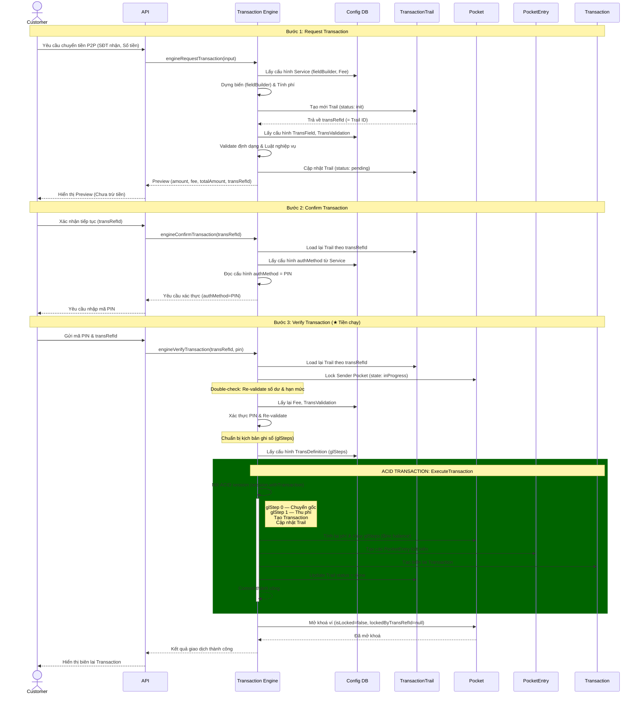
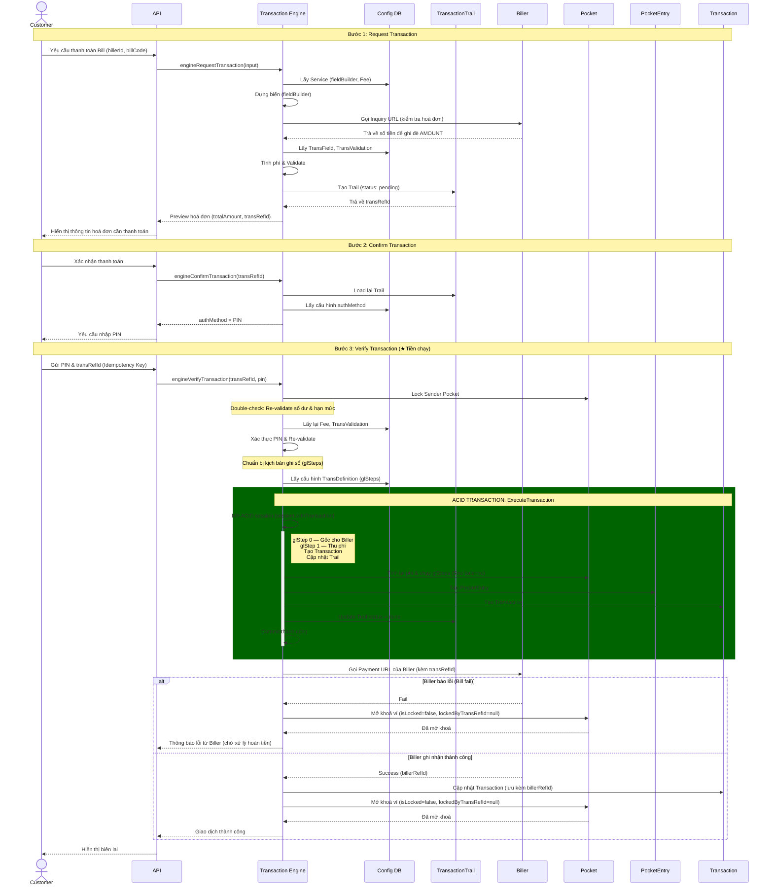
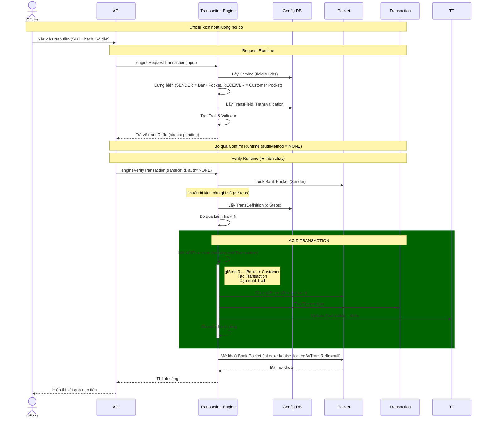

# Mini-Wallet — Sequence Diagram Design

---

## PHẦN 1 — P2P TRANSFER

```mermaid
sequenceDiagram
    actor C as Customer
    participant A as API
    participant TE as Transaction Engine
    participant CFG as Config DB
    participant TT as TransactionTrail
    participant P as Pocket
    participant PE as PocketEntry
    participant T as Transaction

    Note over C, T: Bước 1: Request Transaction
    C->>A: Yêu cầu chuyển tiền P2P (SĐT nhận, Số tiền)
    A->>TE: engineRequestTransaction(input)
    TE->>CFG: Lấy cấu hình Service (fieldBuilder, Fee)
    TE->>TE: Dựng biến (fieldBuilder) & Tính phí
    TE->>TT: Tạo mới Trail (status: init)
    TT-->>TE: Trả về transRefId (= Trail ID)
    TE->>CFG: Lấy cấu hình TransField, TransValidation
    TE->>TE: Validate định dạng & Luật nghiệp vụ
    TE->>TT: Cập nhật Trail (status: pending)
    TE-->>A: Preview (amount, fee, totalAmount, transRefId)
    A-->>C: Hiển thị Preview (Chưa trừ tiền)

    Note over C, T: Bước 2: Confirm Transaction
    C->>A: Xác nhận tiếp tục (transRefId)
    A->>TE: engineConfirmTransaction(transRefId)
    TE->>TT: Load lại Trail theo transRefId
    TE->>CFG: Lấy cấu hình authMethod từ Service
    TE->>TE: Đọc cấu hình authMethod = PIN
    TE-->>A: Yêu cầu xác thực (authMethod=PIN)
    A-->>C: Yêu cầu nhập mã PIN

    Note over C, T: Bước 3: Verify Transaction (★ Tiền chạy)
    C->>A: Gửi mã PIN & transRefId
    A->>TE: engineVerifyTransaction(transRefId, pin)
    TE->>TT: Load lại Trail theo transRefId
    TE->>P: Lock Sender Pocket (state: inProgress)
    Note over TE: Double-check: Re-validate số dư & hạn mức
    TE->>CFG: Lấy lại Fee, TransValidation
    TE->>TE: Xác thực PIN & Re-validate
    
    Note over TE: Chuẩn bị kịch bản ghi sổ (glSteps)
    TE->>CFG: Lấy cấu hình TransDefinition (glSteps)
    rect rgb(0, 100, 0)
    Note over TE, T: ACID TRANSACTION: ExecuteTransaction
    TE->>TE: Mở ACID session (session.withTransaction)
    activate TE
    Note right of TE: glStep 0 — Chuyển gốc<br/>glStep 1 — Thu phí<br/>Tạo Transaction<br/>Cập nhật Trail
    TE->>P: Tính lại phí & chạy glSteps ($inc balance)
    TE->>PE: Tạo các PocketEntry bất biến
    TE->>T: Tạo biên lai Transaction
    TE->>TT: Update Trail status = done
    TE-->>TE: Commit thành công
    deactivate TE
    end
    
    TE->>P: Mở khoá ví (isLocked=false, lockedByTransRefId=null)
    P-->>TE: Đã mở khoá
    TE-->>A: Kết quả giao dịch thành công
    A-->>C: Hiển thị biên lai Transaction
```

---

## PHẦN 2 — BILL PAYMENT

```mermaid
sequenceDiagram
    actor C as Customer
    participant A as API
    participant TE as Transaction Engine
    participant CFG as Config DB
    participant TT as TransactionTrail
    participant B as Biller
    participant P as Pocket
    participant PE as PocketEntry
    participant T as Transaction

    Note over C, T: Bước 1: Request Transaction
    C->>A: Yêu cầu thanh toán Bill (billerId, billCode)
    A->>TE: engineRequestTransaction(input)
    TE->>CFG: Lấy Service (fieldBuilder, Fee)
    TE->>TE: Dựng biến (fieldBuilder)
    TE->>B: Gọi Inquiry URL (kiểm tra hoá đơn)
    B-->>TE: Trả về số tiền để ghi đè AMOUNT
    TE->>CFG: Lấy TransField, TransValidation
    TE->>TE: Tính phí & Validate
    TE->>TT: Tạo Trail (status: pending)
    TT-->>TE: Trả về transRefId
    TE-->>A: Preview hoá đơn (totalAmount, transRefId)
    A-->>C: Hiển thị thông tin hoá đơn cần thanh toán

    Note over C, T: Bước 2: Confirm Transaction
    C->>A: Xác nhận thanh toán
    A->>TE: engineConfirmTransaction(transRefId)
    TE->>TT: Load lại Trail
    TE->>CFG: Lấy cấu hình authMethod
    TE-->>A: authMethod = PIN
    A-->>C: Yêu cầu nhập PIN

    Note over C, T: Bước 3: Verify Transaction (★ Tiền chạy)
    C->>A: Gửi PIN & transRefId (Idempotency Key)
    A->>TE: engineVerifyTransaction(transRefId, pin)
    TE->>P: Lock Sender Pocket
    Note over TE: Double-check: Re-validate số dư & hạn mức
    TE->>CFG: Lấy lại Fee, TransValidation
    TE->>TE: Xác thực PIN & Re-validate
    
    Note over TE: Chuẩn bị kịch bản ghi sổ (glSteps)
    TE->>CFG: Lấy cấu hình TransDefinition (glSteps)
    rect rgb(0, 100, 0)
    Note over TE, T: ACID TRANSACTION: ExecuteTransaction
    TE->>TE: Mở ACID session (session.withTransaction)
    activate TE
    Note right of TE: glStep 0 — Gốc cho Biller<br/>glStep 1 — Thu phí<br/>Tạo Transaction<br/>Cập nhật Trail
    TE->>P: Tính lại phí & chạy glSteps ($inc balance)
    TE->>PE: Tạo PocketEntry
    TE->>T: Tạo Transaction
    TE->>TT: Update Trail status = done
    TE-->>TE: Commit thành công
    deactivate TE
    end
    
    TE->>B: Gọi Payment URL của Biller (kèm transRefId)
    alt Biller báo lỗi (Bill fail)
        B-->>TE: Fail
        TE->>P: Mở khoá ví (isLocked=false, lockedByTransRefId=null)
        P-->>TE: Đã mở khoá
        TE-->>A: Thông báo lỗi từ Biller (chờ xử lý hoàn tiền)
    else Biller ghi nhận thành công
        B-->>TE: Success (billerRefId)
        TE->>T: Cập nhật Transaction (lưu kèm billerRefId)
        TE->>P: Mở khoá ví (isLocked=false, lockedByTransRefId=null)
        P-->>TE: Đã mở khoá
        TE-->>A: Giao dịch thành công
    end
    A-->>C: Hiển thị biên lai
```

---

## PHẦN 3 — CASH-IN

```mermaid
sequenceDiagram
    actor O as Officer
    participant A as API
    participant TE as Transaction Engine
    participant CFG as Config DB
    participant P as Pocket
    participant T as Transaction

    Note over O, T: Officer kích hoạt luồng nội bộ
    O->>A: Yêu cầu Nạp tiền (SĐT Khách, Số tiền)
    
    Note over A, T: Request Runtime
    A->>TE: engineRequestTransaction(input)
    TE->>CFG: Lấy Service (fieldBuilder)
    TE->>TE: Dựng biến (SENDER = Bank Pocket, RECEIVER = Customer Pocket)
    TE->>CFG: Lấy TransField, TransValidation
    TE->>TE: Tạo Trail & Validate
    TE-->>A: Trả về transRefId (status: pending)
    
    Note over A, T: Bỏ qua Confirm Runtime (authMethod = NONE)
    
    Note over A, T: Verify Runtime (★ Tiền chạy)
    A->>TE: engineVerifyTransaction(transRefId, auth=NONE)
    TE->>P: Lock Bank Pocket (Sender)
    Note over TE: Chuẩn bị kịch bản ghi sổ (glSteps)
    TE->>CFG: Lấy TransDefinition (glSteps)
    TE->>TE: Bỏ qua kiểm tra PIN
    
    rect rgb(0, 100, 0)
    Note over TE, T: ACID TRANSACTION
    TE->>TE: Mở ACID session (session.withTransaction)
    activate TE
    Note right of TE: glStep 0 — Bank -> Customer<br/>Tạo Transaction<br/>Cập nhật Trail
    TE->>P: Chạy glSteps ($inc balance)
    TE->>T: Tạo Transaction
    TE->>TT: Update Trail status = done
    TE-->>TE: Commit thành công
    deactivate TE
    end
    
    TE->>P: Mở khoá Bank Pocket (isLocked=false, lockedByTransRefId=null)
    P-->>TE: Đã mở khoá
    TE-->>A: Thành công
    A-->>O: Hiển thị kết quả nạp tiền
```